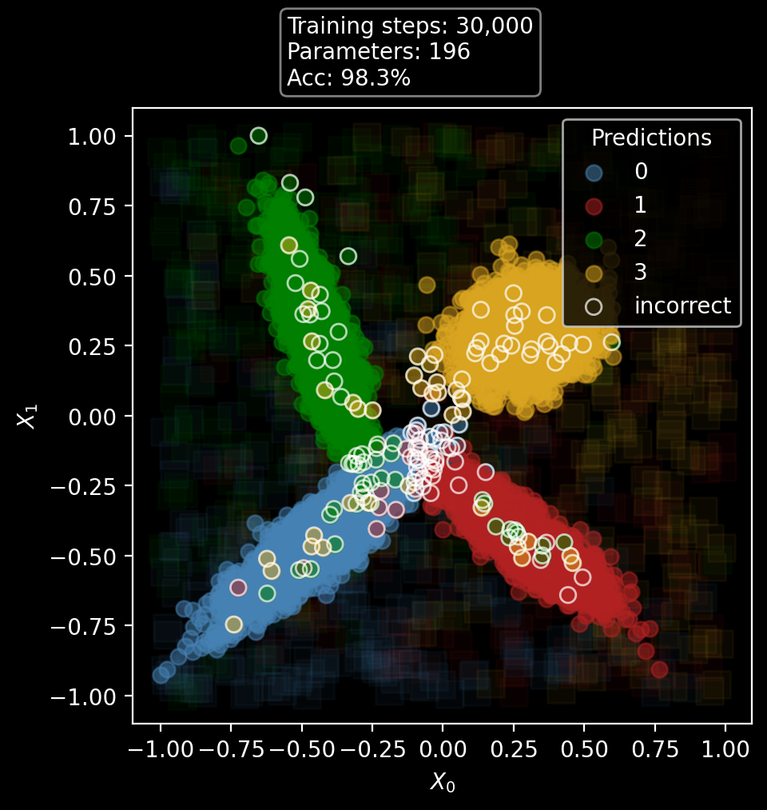
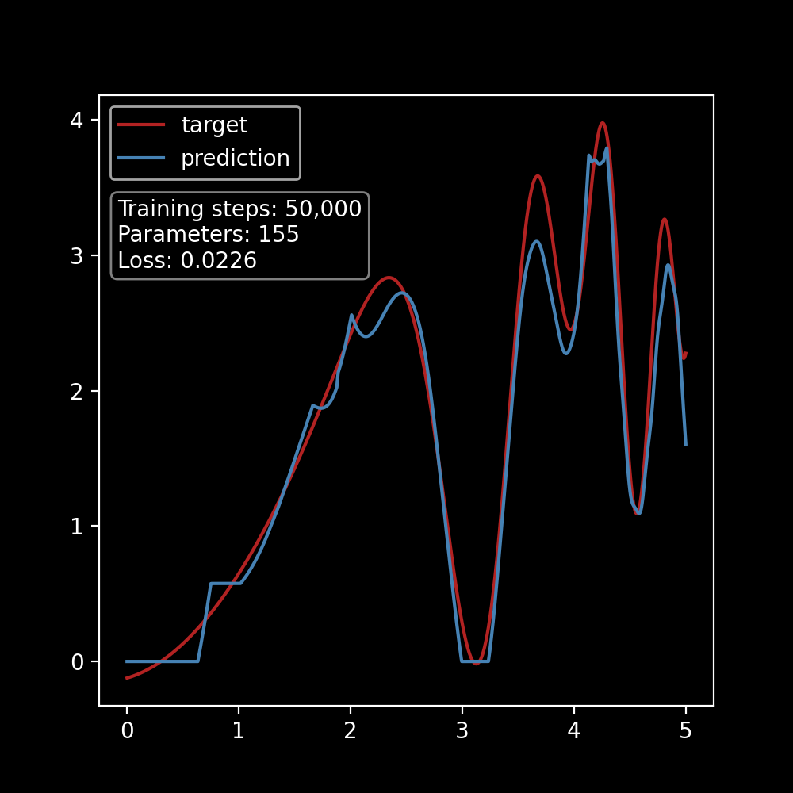
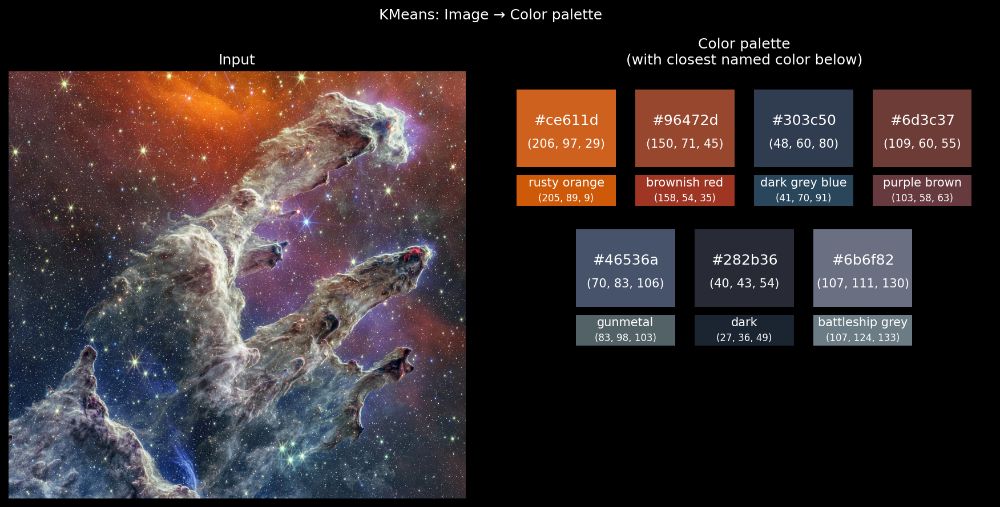
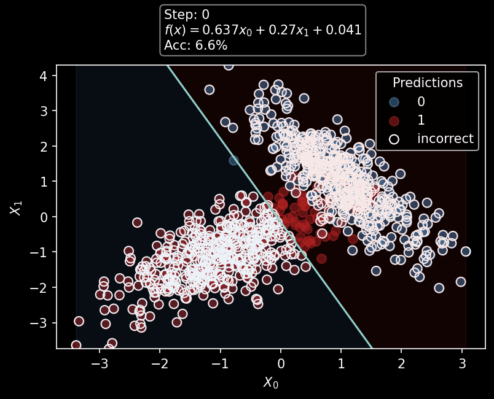
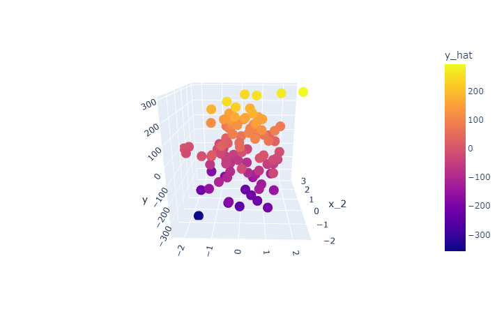
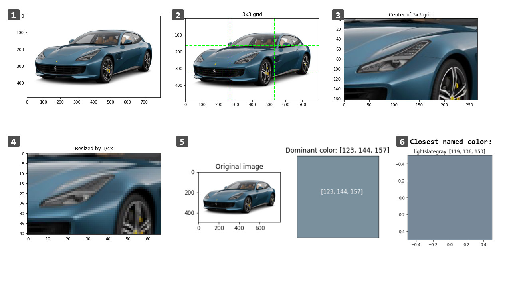
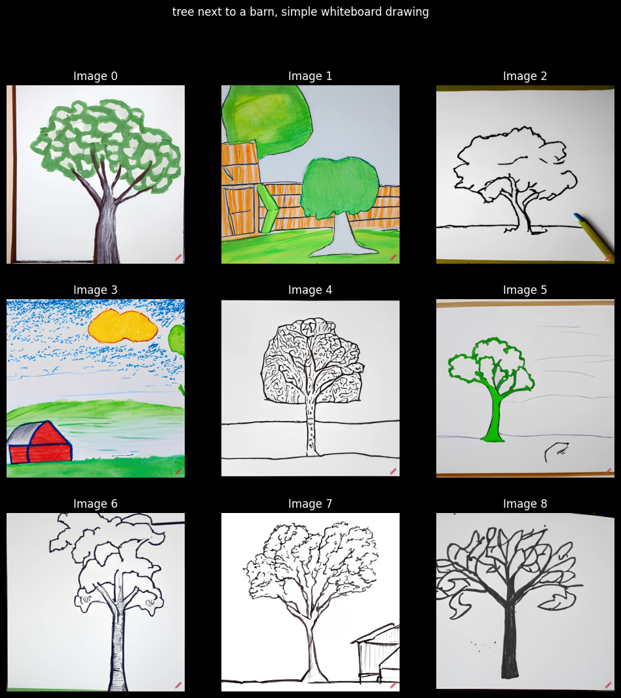
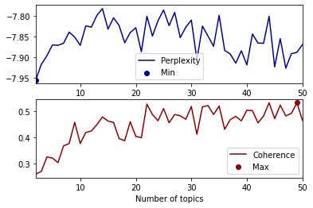
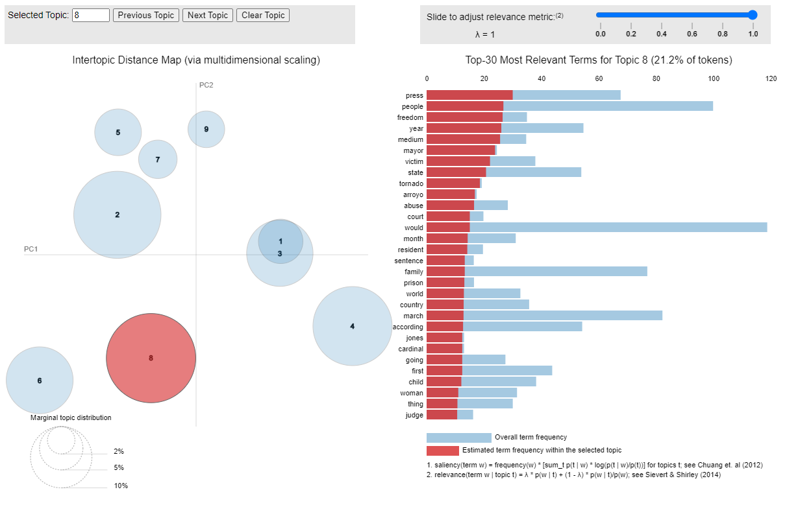
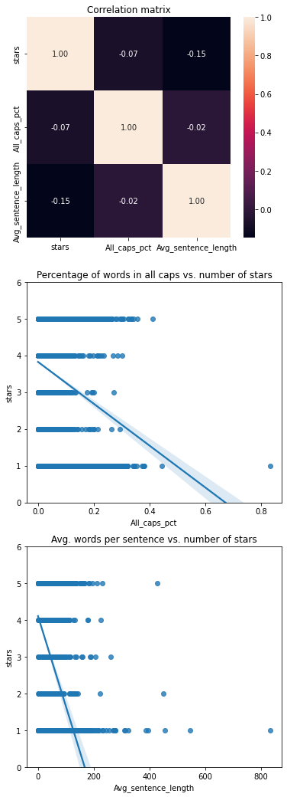

# Machine Learning projects
This repository contains an assortment of my projects in machine learning. Here's a brief overview of some of what you'll find here:

# ML from Scratch
The [ml_from_scratch](./ml_from_scratch/) folder contains notebooks where I implement various machine learning algorithms from scratch using only `NumPy`. Each notebook contains detailed documentation, mathematical explanations, and demos to experiment with the algorithms.

I built these projects to practice the skill of taking mathematical formulas and turning them into vectorized code. As such, I did not review anyone else's code related to these algorithms but rather studied their mathematical formulations.

Currently, the algorithms I have implemented are:
- [Neural network](./ml_from_scratch/neural_network_from_scratch.ipynb)
- [K-Means clustering](./ml_from_scratch/kmeans_from_scratch.ipynb)
- [Linear regression](./ml_from_scratch/linear_regression_from_scratch.ipynb)
- [Logistic regression](./ml_from_scratch/logistic_regression_from_scratch.ipynb)

## Neural network from scratch
A configurable fully-connected neural network that can be used for regression or classification tasks. This is an all-purpose algorithm that can be applied to many tasks like word embeddings, time series predictions, or multiclass classification (especially when using tabular data).

**Key algorithms used include**: backpropagation and gradient descent, cross entropy loss, L2 regularization, sigmoid and ReLU activations, forward propagation, normalization, parameter initialization, and a training and validation loop.

Results on sample data:
|   Classification   |   Regression   |
|:------------------:|:--------------:|
|  |  |

## K-Means clustering from scratch
A vectorized implementation of the K-Means clustering algorithm that groups an unlabeled dataset into $k$ _clusters_ (labels) and can then classify new data based on proximity to the cluster centers. Uses include: finding related items in a dataset, segmenting customers, creating color palettes from images, grouping text documents, quantizing a dataset, categorizing transactions.

**Key techniques used include**: Euclidean distance, cosine similarity, vector normalization (L2), and a lot of plotting code for animated visualization.

|  Generate color palettes from images  |
| :------------------------------------:|
|  |

|  Fit to any numerical data  |
|:---------------------------:|
|  |

## Logistic regression from scratch
A logistic regression model for binary classification using gradient descent to optimize the model's parameters. Uses any number of input features.

**Key algorithms include:** binary cross entropy loss (log loss), sigmoid, and threshold selection using the inverse of sigmoid.

Training progress on a sample dataset, showing how the decision boundary is updated through gradient descent:  

## Linear regression from scratch
A linear regression model trained using gradient descent with optional early stopping. Uses any number of input features (i.e., multilinear regression).

**Key algorithms used include**: mean squared error loss, model training through gradient descent.

Results from a multilinear regression demo: notice that `y_hat` (color gradient) closely matches `y` (vertical axis).

# Dominant Color Extraction
In my [dominant color extraction](./dominant_color_extraction.ipynb) notebook, I use the K-Means algorithm to estimate the main color for an image, which I then apply to the task of detecting a vehicle's color given an image of that vehicle. I used this technique in my [vehicle specs](https://github.com/rparkr/ML-practice/blob/main/Vehicle%20specs/Final%20project/ML_pipeline_Vehicle_Specs.ipynb) project as part of a feature engineering pipeline to augment a dataset with vehicle color information.

# Extractive text summarizing
In [this notebook](./extractive_text_summarizing.ipynb), adapted from a tutorial by Usman Malik, I implement a method for extractive text summarizing and use it to summarize Wikipedia articles.

# Craiyon Text2Image
I created a [sort-of API to generate images](./craiyon_text2image.ipynb) using the Craiyon text-to-image model, available at: https://www.craiyon.com/

**Note:** I last updated this notebook in fall 2022; the website may have changed since then and the web requests might not function as intended.

# Text analytics assignments
I took a computational linguistics course and compiled my work on course assignments into a single notebook. In [this notebook](./text_analytics_assignments.ipynb), I compute precision and recall for various NLP algorithms, compare categories and word frequency distributions across a corpus, classify sentiment, use part-of-speech tagging, predict categories using synsets from WordNet, and use LDA to visualize topics, compute the number of topics using perplexity and coherence, and use a lot of RegEx, web scraping, NLTK, and topic modeling with Gensim.

