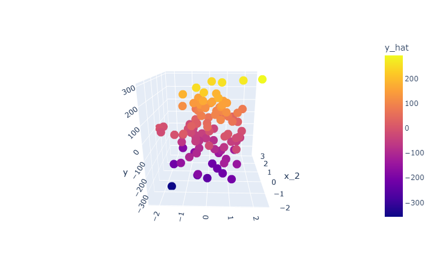

# ML from Scratch
This folder contains notebooks where I implement various machine learning algorithms from scratch using only `NumPy`. Each notebook contains detailed documentation, mathematical explanations, and demos to experiment with the algorithms.

I built these projects to practice the skill of taking mathematical formulas and turning them into vectorized code. As such, I did not review anyone else's code related to these algorithms but rather studied their mathematical formulations.

Currently, the algorithms I have implemented are:
- [Neural network](./neural_network_from_scratch.ipynb)
- [K-Means clustering](./kmeans_from_scratch.ipynb)
- [Linear regression](./linear_regression_from_scratch.ipynb)
- [Logistic regression](./logistic_regression_from_scratch.ipynb)

## Neural network from scratch
A configurable fully-connected neural network that can be used for regression or classification tasks. This is an all-purpose algorithm that can be applied to many tasks like word embeddings, time series predictions, or multiclass classification (especially when using tabular data).

**Key algorithms used include**: gradient descent and backpropagation, cross entropy loss, L2 regularization, sigmoid and ReLU activations, forward propagation, normalization, parameter initialization, and a training and validation loop.

Results on sample data:
|   Classification   |   Regression   |
|:------------------:|:--------------:|
|  |  |

## K-Means clustering from scratch
A vectorized implementation of the K-Means clustering algorithm that groups an unlabeled dataset into $k$ _clusters_ (labels) and can then classify new data based on proximity to the cluster centers. Uses include: finding related items in a dataset, segmenting customers, creating color palettes from images, grouping text documents, quantizing a dataset, categorizing transactions.

**Key techniques used include**: Euclidean distance, cosine similarity, vector normalization (L2), and a lot of plotting code for animated visualization.

|  Generate color palettes from images  |
| :------------------------------------:|
|  |

|  Fit to any numerical data  |
|:---------------------------:|
|  |

## Logistic regression from scratch
A logistic regression model for binary classification using gradient descent to optimize the model's parameters. Uses any number of input features.

Training progress on a sample dataset:  

## Linear regression from scratch
A linear regression model trained using gradient descent with optional early stopping. Uses any number of input features (i.e., multilinear regression).

**Key algorithms used include**: mean squared error loss, model training through gradient descent.

Results from a multilinear regression demo: notice that `y_hat` (color gradient) closely matches `y` (vertical axis).

